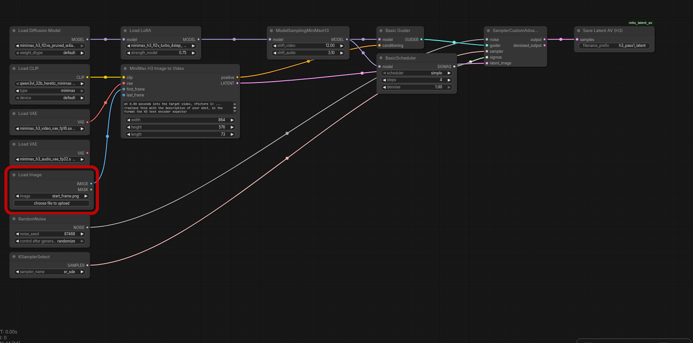
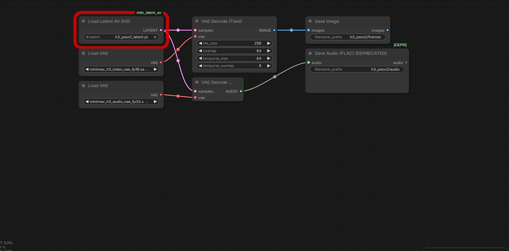

# ComfyUI H3 LatentAV

Two custom nodes that save and load the **audio+video latent of MiniMax H3** in ComfyUI.

They exist because the core `SaveLatent` node cannot write that latent:

```
AttributeError: 'NestedTensor' object has no attribute 'contiguous'
```

The H3 sampler emits a `comfy.nested_tensor.NestedTensor` — a small container holding the
video and audio latents as a list — and the core node calls `.contiguous()` on it. The load
side has the mirror problem: the H3 VAE checks `.is_nested` on the object, so a flat
reconstruction of the parts is rejected with `'list' object has no attribute 'is_nested'`.

`SaveLatentAV` / `LoadLatentAV` store the object as-is and hand it back untouched, which is
what makes it possible to **split an H3 render into two passes and decode the VAE on the
GPU** — the difference between a 5 s clip taking ~60 minutes and taking ~13-15 minutes on an
8 GB card.

No file of core ComfyUI is modified.

## Do you need this?

**Only if you split the render into two runs.** If your card can hold the UNet and the VAE at the same
time — a recent NVIDIA card with ~16 GB or more, or the bigger RDNA cards — you sample and decode in a
single run, exactly like the official MiniMax H3 template does, and you never touch these nodes.

What the split buys you is not a workaround for weak hardware alone: the VAE decode is the largest VRAM
peak of the pipeline, so on a small card the two halves cannot coexist at all.

Now the part that is easy to get wrong: **the core nodes cannot write an H3 AV latent on any card.**
In `nodes.py`, `SaveLatent.save` does `samples["samples"].contiguous()` with no dtype, device or
architecture condition — the nested object has no `.contiguous()` anywhere — and it stores safetensors,
which has no representation for a nested video+audio pair. Core `LoadLatent` expects a single
`latent_tensor` key inside a `.latent` safetensors file in `input/`. So with core nodes the split is
impossible *regardless of how much VRAM you have*.

That makes these nodes useful past the low-VRAM case, whenever you want a render to be resumable:

- re-decode the same sampling with a different tiling config instead of paying for the sampling again
  (11-16 min per attempt on the setup measured below),
- A/B the VAE or the tiling on a single sampling run,
- queue several samplings and decode them later in a second batch,
- move the latent between machines, or keep it while the server is restarted for any reason,
- long clips where the decode runs out of memory even though the sampling fit.

If none of that applies to you, install nothing — the official H3 template with `VAEDecodeTiled` (or
plain `VAEDecode`, if the VAE fits next to your UNet) is all you need.

## Install

```bash
cd ComfyUI/custom_nodes
git clone https://github.com/enrand22/ComfyUI-H3-LatentAV.git
```

Restart ComfyUI (or reload the node list). The nodes appear under the `latent` category as
**Save Latent AV (H3)** and **Load Latent AV (H3)**.

## Nodes

| node | in | out | notes |
|---|---|---|---|
| `SaveLatentAV` | `samples` (LATENT), `filename_prefix` | – (output node) | writes `output/latent_av/<prefix>_<timestamp>.pt` and a stable `<prefix>.pt` symlink |
| `LoadLatentAV` | `latent` (filename from `output/latent_av/`) | `LATENT` | loads it back as the original nested object |

## Workflows (ready to load)

Two UI workflows that use these nodes, in `workflows/`:

| file | what it does | notable values |
|---|---|---|
| `h3_pass1_sample_latent.json` | the whole sampling half: text encoder + UNet + turbo LoRA + the H3 image-to-video conditioning + the 4-step custom sampler, ending in **Save Latent AV** | `864x576`, `length 73`, `er_sde` / `simple` / 4 steps, `shift_video 12` / `shift_audio 3.1`, LoRA strength `0.75` |
| `h3_pass2_decode_latent.json` | the decode half: **Load Latent AV** → `VAEDecodeTiled` (video) + `VAEDecodeAudio` → `SaveImage` + `SaveAudio` | tile `256` / overlap `64` / temporal `64` / temporal overlap `8` |





**How to open them:** ComfyUI → *Workflow → Open* (or drag the `.json` onto the canvas). They are
regular frontend workflows — the same ones the screenshots above show, exported from the UI.

**Before you queue them, three things:**

1. **Pass 1 — point it at your own input.** `Load Image` must hold your start frame, and the shot
   description inside `MiniMax H3 Image to Video` is the placeholder
   `at 0.00 seconds into the target video, <Picture 1> ...`. Replace it with your prompt in the format
   the H3 text encoder expects.
2. **Both — the model filenames must exist** in `models/diffusion_models`, `models/text_encoders`,
   `models/vae` and `models/loras` (or just pick your files in the dropdowns). The names in the
   workflows are the ones these measurements were taken with.
3. **Pass 2 — pick your latent** in the `Load Latent AV` dropdown: it lists `output/latent_av/*.pt`,
   i.e. whatever pass 1 wrote. The node shows a red *"missing a required model file"* badge in the
   screenshots above precisely because that file did not exist when they were taken — that badge is
   expected until you select your own.

Run pass 1 with the VAE on the CPU (`--cpu-vae`), then restart ComfyUI without that flag and run
pass 2, as described below.

The same two graphs are also in `examples/` in **API format** (`{"prompt": {...}}`), for posting
straight to `/prompt` from a script; the UI versions above are the same graph, just serialized by the
frontend.

## The two-pass pipeline

Sample with the VAE on the CPU, then decode with the VAE on the GPU in a separate server run:

1. **Pass 1** — server started with `--cpu-vae`: model + text encoder + sampler, output goes to
   `SaveLatentAV`. The VAE stays off the GPU, so the sampler gets the whole card.
   ≈11-16 min for a 5-8 s clip.
2. **Restart ComfyUI without `--cpu-vae`** so the VAE lands in VRAM. Nothing else is resident,
   so there is no competition for the 8 GB.
3. **Pass 2** — `LoadLatentAV` → `VAEDecodeTiled` (video) + `VAEDecodeAudio`, then `SaveImage` +
   `SaveAudio`. ≈1.3-2.3 min, no sampling.

The split is not a preference: `--cpu-vae` and a GPU-resident VAE are mutually exclusive per
server run, and `VAELoader` exposes no `device` input, so one process cannot sample with the
VAE on the CPU and decode it on the GPU. `examples/h3_pass1_latent.json` and
`examples/h3_pass2_decode_tiled.json` are the two graphs, ready to load as API prompts
(replace the model filenames and the `LoadImage` file with your own).

## Measured numbers

All of it on one machine: **Radeon RX 7600, 8 GB VRAM (gfx1102, ROCm)**, 46 GB RAM, single
consumer card, MiniMax H3 FL2VA (pruned w4a8) + the 4-step turbo LoRA.

| clip | latent volume V | sampling (pass 1) | tiled decode (pass 2) | total | one pass, VAE on CPU |
|---|---|---|---|---|---|
| 141 f @ 864×576 (5.88 s) | 274K | 11.3 min | ~2 min | **~13-15 min** | 57-67 min |
| 175 f @ 864×576 (7.29 s) | 340K | ~16 min | 2.3 min | **19.1 min** | – |
| 243 f @ 640×448 (10.1 s) | 272K | 11.0 min | 1.3 min | **12.3 min** | – |

- Cost tracks the **latent volume**, not the seconds: `V = (width/16) × (height/16) × frames`.
  243 frames at 640×448 costs the same as 141 frames at 864×576.
- Sampling scales linearly with V: ≈ `4 steps × 0.60 s × V` (V in thousands), with a penalty
  close to the VRAM ceiling.
- VRAM thresholds measured on this card: `V ≤ 330K` safe · `340K` borderline (works, slower) ·
  `373K` → `CUDA out of memory` in `SamplerCustomAdvanced`. At 864×576 the ceiling is
  **175 frames (7.3 s)**; 192 frames already fails.
- Decoding with the VAE on the **CPU** is the thing worth eliminating: 49-59 min for 141 frames,
  and the log prints nothing for the whole time — it looks hung, and people kill healthy runs
  because of it.
- Tiled decode measured ~83 s for 141 frames at 6.0-6.2 GB peak VRAM. Tile size 128/256/384/512
  changed **neither the time (±5 s) nor a single pixel** — outputs were pixel-identical, so pick
  the smallest tile that fits (256 works; 512 peaks ~170 MB higher).
- Splitting the passes also cuts RAM: with the VAE out of the sampling run, RSS dropped from
  ~42-45 GB (swapping) to 24-31 GB.

## Pitfalls

- **Point pass 2 at the exact timestamped file.** `LoadLatentAV` takes a filename, and ComfyUI's
  execution cache keys on node inputs: if a second job reuses the same `<prefix>.pt` alias, the
  cache can hand back the *previous* decode — a different clip, silently. The stable symlink is a
  convenience for a single sequential job; for anything automated, rewrite the filename to the
  timestamped file the pass-1 run just created.
- **Never keep the VAE and the UNet resident at once on a small card.** With the VAE loaded in the
  GPU during sampling, a short clip went from 27 s/it to ~119 s/it on the same seed and workflow.
- **Do not trust "the log went quiet" as a hang signal.** Decode on the CPU is legitimately silent
  for ~50 min; sampling prints only once per step (2-4 min per line at this size). Check the phase
  — CPU usage of the process and `gpu_busy_percent` — before killing anything.
- Latent files are small (~7-10 MB for 141 frames), so keeping them lets you re-decode with a
  different tiling config without re-sampling.

## Testing

```bash
COMFYUI_PATH=/path/to/ComfyUI python tests/test_roundtrip.py
```

Builds a latent with the real `comfy.nested_tensor.NestedTensor` class, saves it through
`SaveLatentAV`, loads it back with `LoadLatentAV` and asserts the tensors come back identical
with `is_nested` intact. It writes only to a temp directory. Defaults to `../..` as the ComfyUI
root for a normal `custom_nodes/` install.

## License

MIT.
